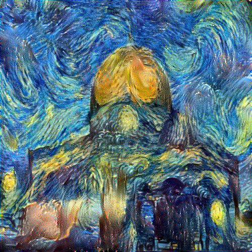

# Neural Style Transfer (NST) Implementation

This repository provides an implementation of **Neural Style Transfer (NST)**, a technique used to blend the content of one image with the style of another, producing a new image that combines the content from the first image and the artistic style of the second.

The repository includes the core functionality for performing Neural Style Transfer, as well as a tool to visualize the evolution of the style transfer process over time.

## Table of Contents
- [Neural Style Transfer (NST) Implementation](#neural-style-transfer-nst-implementation)
  - [Table of Contents](#table-of-contents)
  - [What is Neural Style Transfer?](#what-is-neural-style-transfer)
  - [Files](#files)
    - [`main.py`](#mainpy)
    - [`video_creator.py`](#video_creatorpy)
    - [`analysisperformance`](#analysisperformance)
  - [Images and Videos](#images-and-videos)

## What is Neural Style Transfer?

Neural Style Transfer (NST) is a deep learning technique that uses convolutional neural networks (CNNs) to merge the content of one image (the "content image") with the style of another image (the "style image"). The goal is to create a new image that maintains the key content of the original image while adopting the artistic features (such as color, texture, and brushstrokes) of the style image.

The process works by:
1. Extracting the content features from the content image using a pre-trained CNN.
2. Extracting the style features from the style image using the same CNN.
3. Optimizing a random image to minimize the difference in both content and style from the target content and style images.

The result is a new image that represents a harmonious blend of content and style.

## Files

### `main.py`
`main.py` contains the main implementation of the Neural Style Transfer algorithm. It includes functions for:
- Loading and preprocessing images.
- Extracting content and style features using a pre-trained CNN **SOTA** model (VGG19).
- Implementing the optimization loop to minimize content and style loss, thereby generating the output image.

### `video_creator.py`
`video_creator.py` contains a function that allows you to create a video from a series of images. This is useful for tracking the progress of the style transfer during training. The video can show the gradual transformation from the initial content image to the final stylized output.

### `analysisperformance`
The `analysis_performance.py` script manages Neural Style Transfer (NST) data by extracting .zip files, and find epoch and cost details from image name as stored. Then visualize the cost during epochs in a line plot then saved as epoch_cost_plot.png

## Images and Videos

The repository contains a set of images used for different experiments to demonstrate the effectiveness of Neural Style Transfer. And this is just a sample:

- **Content Image**:

  
- **Style Image**:

Additionally, we have a video that tracks the changes during the style transfer process. You can watch the video here:

- **Style Transfer Progress Video**:

These images and videos are meant to help you visualize how the NST process works and how the content and style gradually merge over the course of training.
